# reto-tecnico-CTC

RETO TÉCNICO: Cuida Tu Comunidad (CTC)

# Pasos para configurar en local el proyecto para su revicion

# Instalación y configuración en local

Pasos para iniciar el proyecto de forma local

## Clonar el repositorio

```bash
    git clone https://github.com/MiguelAngelMP10/reto-tecnico-CTC
```

## Moverse a la carpeta del proyecto

```bash
   cd reto-tecnico-CTC
```

## Laravel

### Entrar a la carpeta con nombre laravel

```bash
   cd laravel
```

### Instalación de dependecias

```bash
composer install
```

## Configuraciones

Realizar copia del archivo .env.example

```text
    cp .env.example .env
```

Generar key de aplicación

```bash
  php artisan key:generate
```

## Configuración de bases de datos _SQLite_

### SQLite

#### Crear archivo .sqlite

```bash
touch database/database.sqlite
```

### Configurar en archivo .env los siguientes valores

```env
    DB_CONNECTION=sqlite
    DB_DATABASE=/absolute/path/to/database.sqlite
```

## Se ejecutan las migraciones para construir las tablas necesarias y senbrar información fake para el proyecto

```bash
php artisan migrate --seed
```

## logs

```log
INFO  Preparing database.

Creating migration table ................................................................................................................ 3ms DONE

INFO  Running migrations.

2014_10_12_000000_create_users_table .................................................................................................... 3ms DONE
2014_10_12_100000_create_password_reset_tokens_table .................................................................................... 2ms DONE
2019_08_19_000000_create_failed_jobs_table .............................................................................................. 3ms DONE
2019_12_14_000001_create_personal_access_tokens_table ................................................................................... 5ms DONE
2023_09_27_151039_create_tasks_table .................................................................................................... 2ms DONE
2023_09_27_151739_create_states_table ................................................................................................... 2ms DONE


INFO  Seeding database.

Database\Seeders\StateSeeder ............................................................................................................. RUNNING  
Database\Seeders\StateSeeder ........................................................................................................ 1.44 ms DONE
```

## Arrancamos el proyecto con

```bash
    php artisan serve
```

## React

### Entrar a la carpeta con nombre react

```bash
   cd react
```

### Instalar las dependencias

```bash
  npm install
```

### Para correct el proyecto de forma local

```bash
  npm run dev 
```

### Con estos pasos podemos levantar los dos proyectos

### Adjunto imagenes de las interfaces de los requerimientos

* Interfaz Inicial: Al ingresar a la aplicación, el usuario deberá ver una lista de tareas con los siguientes datos:
  título, descripción, fecha de creación, estado de la república, nombre del creador y número de "likes". Además, se
  deberá mostrar un botón para crear una nueva tarea y otro botón para otorgar "like" a cada tarea presente en la lista.
  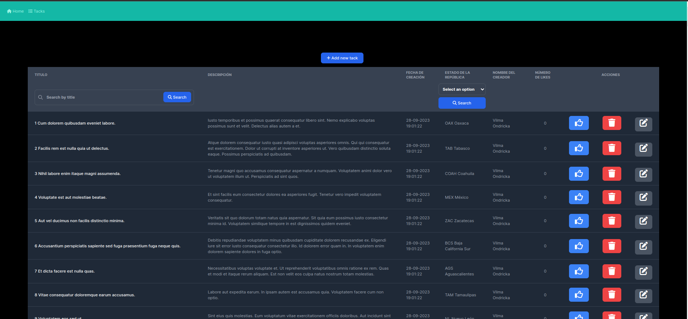
* Funcionalidad de "Likes": Cada tarea contará con un botón de "Like". Al presionar este botón, la cantidad de "likes"
  de dicha tarea debe incrementarse y el botón se debe deshabilitar para esa tarea específica en la vista actual (Si
  recargo la pagina el botón debe esta habilitado de nuevo.
  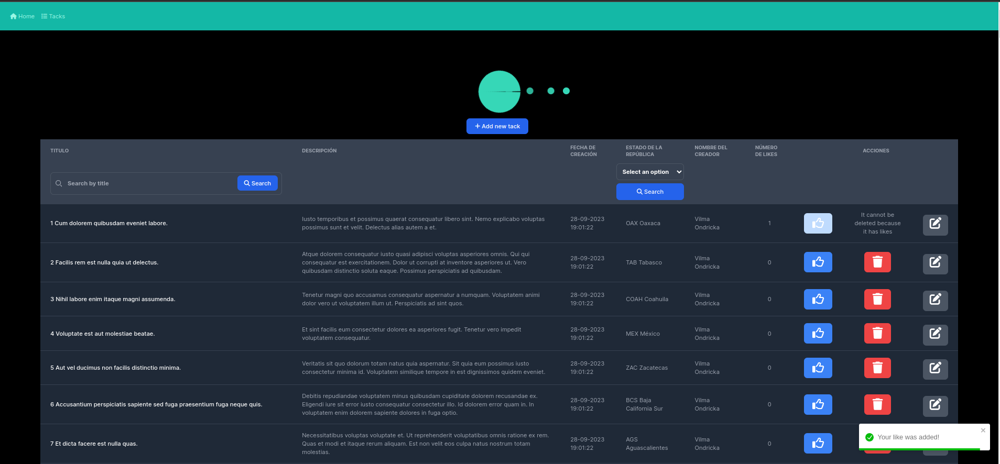
  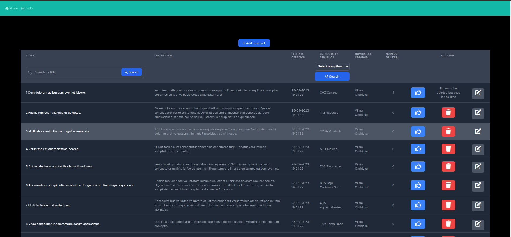
* Creación de Tareas: Debe existir un formulario que permita ingresar los siguientes datos: título, descripción, fecha,
  estado de la república y el nombre del creador.
  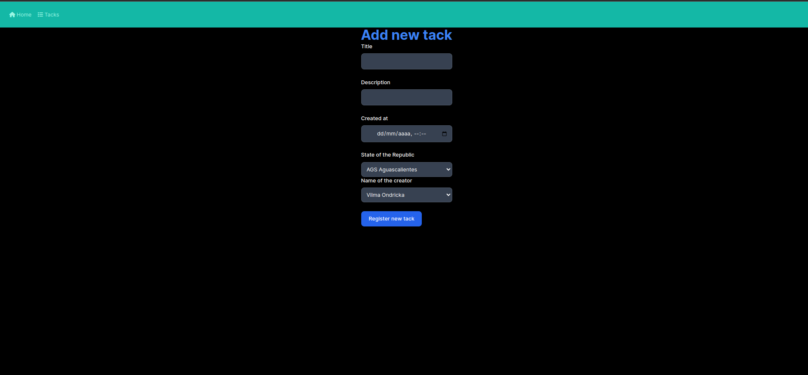
  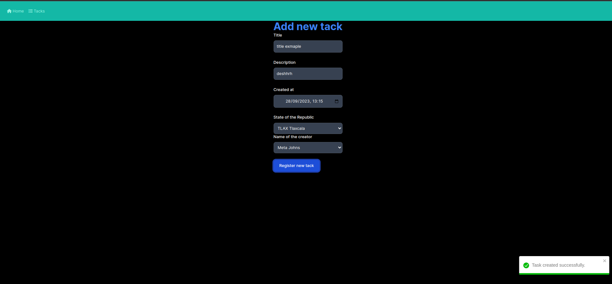
* Edición de Tareas: Las tareas no deben ser editables (solo el contador de likes).
  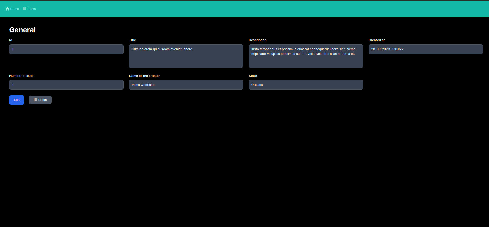
  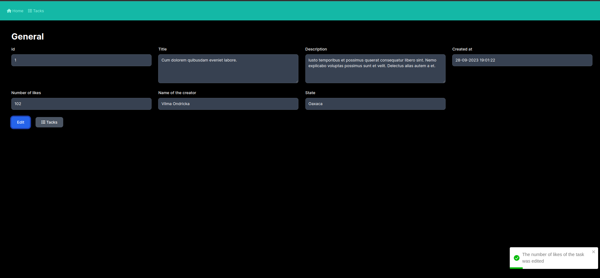
* Eliminación de Tareas: Se deben poder eliminar tareas, pero sólo si no tienen "likes" asociados.
  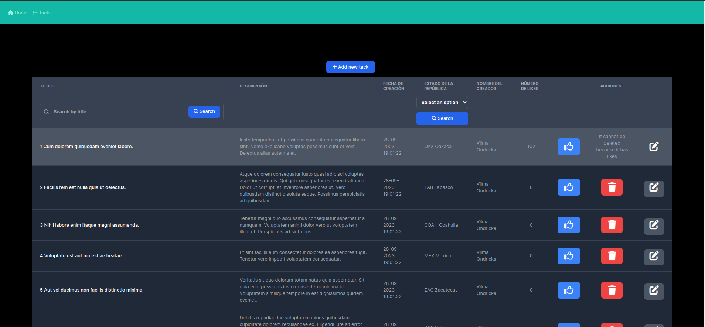
  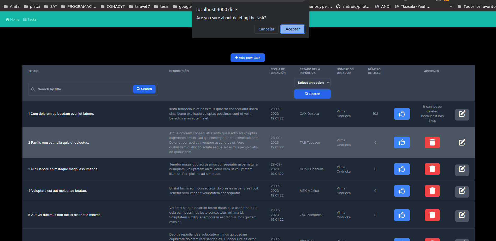
  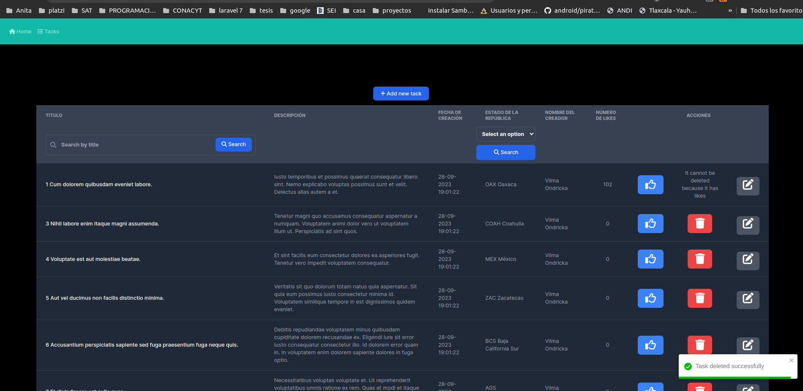
* Filtrado y Búsqueda: Los usuarios deben tener la capacidad de buscar tareas por título o estado.
  Filtro por titulo
  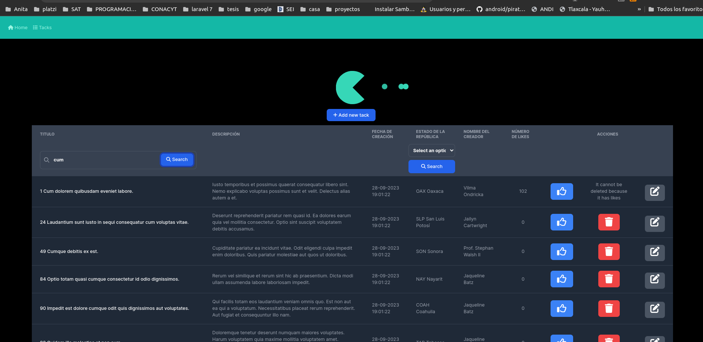
  Filtro por estado
  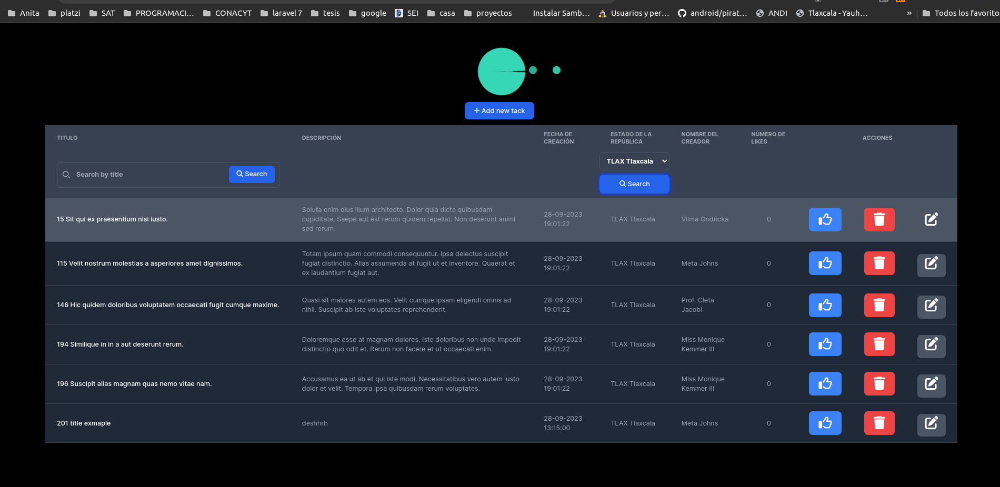